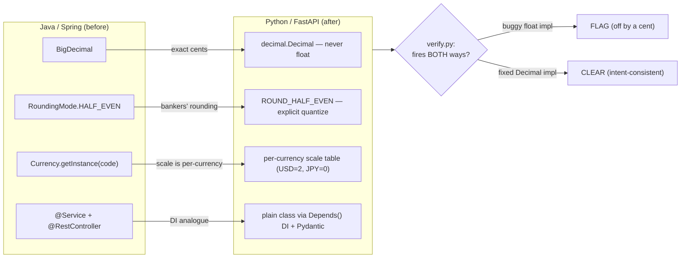

# Money migration: Java/Spring → Python/FastAPI, with a reproducible verification trail

[](https://github.com/juanfranpaezz/money-migration-java-to-python/actions/workflows/ci.yml)
[](LICENSE)

A small, self-contained engineering case study. It takes a realistic fintech building
block — a **money value-object with safe arithmetic** — migrates it from idiomatic
**Java/Spring** to idiomatic **Python/FastAPI**, and then runs a **deterministic,
reproducible verification** over the result.

**Why it matters.** Money code is where "it mostly works" quietly loses real cents:
binary `float` can't represent `0.10` exactly, the wrong rounding mode skews every
settlement, and not every currency has two decimal places. Getting a money port right is
less about syntax and more about *not* falling into those traps — and about being able to
*prove* you didn't. This repo does both: a clean port that documents each trap, and a
mechanical check that plants one of those exact bugs and demonstrates the check catches it
(and clears the fix) — with a zero-false-positive control.

Greenfield, no secrets, no paid services. The money logic and the verification need
**nothing beyond the Python standard library**; the optional HTTP layer needs FastAPI.

## Table of contents

- [What's in here](#whats-in-here)
- [1. The migration, before → after](#1-the-migration-before--after)
  - [The money traps (the load-bearing part)](#the-money-traps-the-load-bearing-part-of-the-migration)
- [2. The verification — a reproducible trail that fires both ways](#2-the-verification--a-reproducible-trail-that-fires-both-ways)
- [3. Reproduce it (exact commands)](#3-reproduce-it-exact-commands)
- [Honest framing — what this does and does NOT claim](#honest-framing--what-this-does-and-does-not-claim)

---

## What's in here

```
java-spring/         the original idiomatic Java/Spring version
  src/main/java/com/example/payments/
    Money.java               money value-object: BigDecimal, HALF_EVEN, Currency
    OrderTotalService.java   a @Service bean: subtotal + tax
    Demo.java                a plain main that prints the reference numbers
  pom.xml                    Maven build; brings in the real Spring @Service (spring-context)

python-fastapi/      the idiomatic Python/FastAPI migration
  app/money.py         Money value-object: Decimal, ROUND_HALF_EVEN, currency table
  app/service.py       OrderTotalService (plain class, DI-provided)
  app/api.py           FastAPI surface: Pydantic models + Depends() DI
  run_demo.py          the Python mirror of Demo.java (prints the same lines)
  tests/test_money.py  parity tests: Python must reproduce the Java numbers + the traps

verification/        the verification discipline applied to the migrated code
  impl_buggy.py        the suspect order-total with a PLANTED float-money bug (self-certifying)
  impl_fixed.py        the correct Decimal version
  verify.py            derives an intent postcondition, proves it fires BOTH ways
  _selfcert.py         the self-contained applier (negative-control + degeneracy guards)
```

---

## 1. The migration, before → after



### Java (before)

```java
Money a = Money.of("0.10", "USD");
Money b = Money.of("0.20", "USD");
a.add(b);                       // -> 0.30 USD   (exact, never 0.30000000000000004)

Money.of("2.005", "USD");       // -> 2.00 USD   (HALF_EVEN: rounds to the even neighbour)
Money.of("199.7", "JPY");       // -> 200  JPY   (JPY has 0 minor units)

orderTotalService.total(        // 3 x 19.99 USD + 21% tax
    List.of(new LineItem(Money.of("19.99","USD"), 3)),
    new BigDecimal("0.21"));    // -> 72.56 USD

Money.of("1.00","USD").add(Money.of("1.00","EUR"));  // throws: currency mismatch
```

### Python (after) — `py run_demo.py` prints the *same* numbers

```
0.10 + 0.20 = 0.30 USD
round(2.005) = 2.00 USD
199.7 JPY    = 200 JPY
3x19.99 +21% = 72.56 USD
mismatch     = currency mismatch: USD vs EUR
```

The two sides are byte-for-byte identical on these lines, and the parity is enforced by a
test suite (below), not just eyeballed.

### It's an idiomatic port, not a line-by-line transcription

| Java | Python | why |
|---|---|---|
| `BigDecimal` | `decimal.Decimal` | binary `float` cannot represent decimal cents exactly |
| `RoundingMode.HALF_EVEN` | `decimal.ROUND_HALF_EVEN` | the conventional monetary ("bankers'") rounding |
| `Currency.getInstance(code)` | a small `CURRENCIES` table (code → minor units) | scale is a property of the currency, not a hard-coded 2 |
| `final` class | frozen `@dataclass` | immutability |
| `@Service` bean injected into a `@RestController` | a plain class supplied via `Depends(...)` | FastAPI's DI is the analogue of Spring constructor injection |
| `@RequestBody` DTO + Bean Validation | a Pydantic `BaseModel` (`condecimal`, `field_validator`) | validation at the HTTP edge; money fields are `Decimal`, never `float` |

### The money traps (the load-bearing part of the migration)

These are the three things a careless Java→Python money port gets wrong. Each one is
handled explicitly in `app/money.py` and pinned by a test.

1. **`float` is the default Python number — and it is wrong for money.** `0.1 + 0.2` is
   `0.30000000000000004`, and that error accrues into balances. `Money.of` keeps the
   amount as `Decimal` and **refuses a `float` constructor argument** — because
   `Decimal(0.1)` already carries the float error — mirroring `new BigDecimal("0.10")`
   rather than `new BigDecimal(0.10)`.
2. **Rounding mode is not free in Python.** `Decimal`'s default *context* is HALF_EVEN,
   but Python's built-in `round()` and f-string formatting are **not** the same thing on a
   `float` (`round(2.675, 2)` is `2.67`, a classic float trap). The port quantizes
   **explicitly** with `ROUND_HALF_EVEN`, never `round()`.
3. **Currency scale is per-currency.** USD → 2 minor units, JPY → 0. A hard-coded
   `.quantize("0.01")` silently corrupts JPY (it would invent two decimal places the
   currency doesn't have). The scale is looked up per currency from an ISO-4217 table.

One more consistency detail, fixed on both sides: the currency code is **normalised to
upper case** in `Money.of` in *both* Java and Python, so `"usd"` and `"USD"` behave
identically. Java's `Currency.getInstance` is case-sensitive on its own and would reject
`"usd"`; without the normalisation the two ports would disagree on lower-case input. A
test (`test_currency_code_is_case_insensitive_and_consistent_with_java`) pins it.

---

## 2. The verification — a reproducible trail that fires both ways

The more interesting half. We take the migrated logic, plant a **realistic** bug — the
exact `float` + `round()` trap from above — and run a mechanical check on it.

The bug lives in `verification/impl_buggy.py`, and it **certifies itself**: the body
`assert`s that its own total is "correct", but the assertion is computed the same wrong
way, so it passes while the answer is off by a cent. This is the *self-certification*
pattern — a function whose own internal check rubber-stamps a wrong result. A test that
only re-runs the code's own assertions would be fooled by it.

`verification/verify.py` defeats that by judging the output against intent, not against
the body:

- **It derives a postcondition from the intent only** — "the order total must equal the
  *exact decimal-money* total." The expected value is computed by an **independent
  exact-decimal oracle** written from the spec, so the **FLAG on the buggy impl does not
  depend on the fixed implementation's body** (a third, independent `Fraction`-based
  re-derivation produces the same expected value — see `verification/verify.py`).
- **It has a zero-false-positive negative control.** The known-correct output fed to the
  check is the oracle's answer, *not* lifted from either implementation. If the
  postcondition were wrong, it would reject the oracle's own correct answer, and the check
  would mark itself **untrusted** — so a broken check can't silently "pass."
- **It reuses one self-contained applier.** The postcondition is fed to
  `verification/_selfcert.apply_pc` (it ships with this repo, so it runs on a fresh
  clone), which applies the same negative-control + degeneracy guards rather than a
  one-off check written to make this demo look good.

### The both-ways result (`py verify.py`)

Input: one line, unit price `0.07`, quantity `5`, `10%` tax.

```
Exact money total = (0.07 × 5) × 1.10 = 0.3850 → HALF_EVEN to 2dp = 0.38
Naive float       = 0.35000000000000003 × 1.1 → round(_, 2)       = 0.39   ← off by a cent
```

| impl | output | verdict | trusted? |
|---|---|---|---|
| buggy (`float` + `round`) | `0.39` | **FLAG** — rejects the body's wrong cent | yes |
| fixed (`Decimal` + `HALF_EVEN`) | `0.38` | **CLEAR** — intent-consistent | yes |

```
FIRES BOTH WAYS : True  (flags the bug, clears the fix, trusted in both)
```

The *same* instrument flags the bug **and** clears the fix, and passes its negative
control in **both** runs — so it discriminates between right and wrong output; it isn't
pinned to one verdict. (`0.3850` is the exact pre-rounding product; it rounds to `0.38`
because HALF_EVEN breaks the `…50` tie toward the even digit, `8`.)

---

## 3. Reproduce it (exact commands)

Prerequisites: a JDK 17+ and Maven 3.9+ for the Java side (tested on Temurin 17 and
Maven 3.9.5; the first build downloads `spring-context` from Maven Central), and
Python 3.11+ (invoked as `py` on Windows; use `python3` on macOS/Linux). The Python
core needs **no network and no install** beyond `pytest`; only the optional HTTP
surface needs `pip install`.

```bash
# --- Java side: compile against the real Spring jar and run the reference ---
cd java-spring
mvn -q compile                 # resolves spring-context (the real @Service)
java -cp target/classes com.example.payments.Demo
#   0.10 + 0.20 = 0.30 USD   /   round(2.005) = 2.00 USD   /   199.7 JPY = 200 JPY
#   3x19.99 +21% = 72.56 USD /   mismatch = currency mismatch: USD vs EUR

# --- Python side: same numbers, then the parity tests ---
cd ../python-fastapi
py run_demo.py                 # prints the same five lines as the Java Demo
py -m pytest -q                # 9 passed  (parity + the traps + currency-case)

# --- The verification: prove the check fires BOTH ways ---
cd ../verification
py verify.py                   # human-readable; exit 0 iff both-ways proven
py verify.py --json            # machine-readable

# --- (optional) the FastAPI HTTP surface ---
cd ../python-fastapi
pip install -r requirements.txt
py -m uvicorn app.api:app --reload
#   POST /orders/total  {"lines":[{"unit_price":"19.99","currency":"USD","quantity":3}],"tax_rate":"0.21"}
#   -> {"amount":"72.56","currency":"USD"}
```

Everything is deterministic: same inputs → same numbers, every run. `verify.py` exits `0`
only when the both-ways proof holds, so it is usable as a CI gate directly.

---

## Honest framing — what this does and does NOT claim

This case study demonstrates **process, determinism, and a reproducible trail**. Read that
literally — the claims below are deliberately narrow, and the over-claims are spelled out
so they can't sneak back in.

**What it shows (measured / supported):**

- A **deterministic, reproducible verification trail** over a real migration: same inputs,
  same verdict, every run.
- The check **catches a function that certifies its own wrong result** on a *determinate*
  spec (the money total has exactly one correct value).
- The cost advantage is **amortized**: the postcondition is derived once and re-applied —
  deterministically and for free — on every later version of the code. (It is *not* a
  claim of being cheaper on the first pass.)

**What it deliberately does NOT claim:**

- ❌ *"catches more bugs than a code review."* Not claimed and not measured here. The
  durable value is determinism + amortized cost, **not** out-catching a human reviewer.
- ❌ *"finds bugs a review misses."* Same reason.
